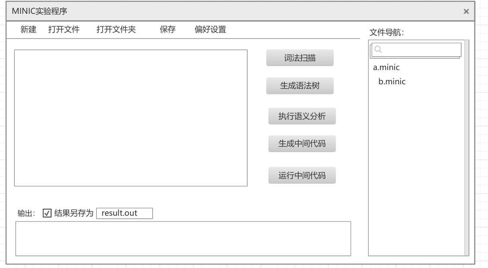

程序分成分成命令行和图形界面两个部分。

命令行程序包括MINIC的词法扫描器，MINIC的语法树产生器，MINIC的语义分析器，MINIC的中间代码产生器，MINIC的虚拟机程序。这些程序彼此独立，可以在终端单独运行

词法扫描器执行词法扫描的流程：
1. 编辑minic源文件，保存为a.mc（任意文件名）
2. 词法扫描器的程序名假设为scanner， 终端执行`./scanner a.mc`(假设scanner程序和a.mc在同一个目录下)
3. 程序会扫描整个a.mc文件， 每识别出一个符号都会在终端打印一行信息，形式为`识别符号<token_name> : <value>`,   `<token_name>`是匹配的预定义符号的名字，`<value>`是匹配符号对应的值

MINIC的语法树产生器的执行流程：
1. 编辑minic源文件，保存为a.mc（任意文件名）
2. MINIC的语法树产生器假设名为genTree， 终端执行`./genTree a.mc`((假设genTree程序和a.mc在同一个目录下)
3. 程序会扫描整个a.mc文件，识别出所有词法符号进行语法解析，在语法规则的规约过程中生成语法树，最终在终端打印语法树的形状,树状效果如下：
=
├── a
└── *
    ├── 2
    └── 3
(a = 2 * 3的语法树)

MINIC的语义分析器的执行流程：
1. 编辑minic源文件，保存为a.mc（任意文件名）
2. 语义分析器程序名假设为analyze， 终端执行`./analyze a.mc`(假设analyze程序和a.mc在同一个目录下)
3. 程序会扫描整个a.mc文件，在进行语法规则的规约的过程中进行符号表的填充，在使用变量和函数的地方完成类型检查，如果有错误则输出具体的错误信息，最终在终端打印符号表信息和错误信息

Mini C 的代码产生器的执行流程：
1. 编辑minic源文件，保存为a.mc（任意文件名）
2. 代码产生器程序名为genCode， 终端执行`./genCode a.mc`(假设genCode程序和a.mc在同一个目录下)
3. 程序扫描整个a.mc文件，在进行语法规则的规约的过程中进行中间代码的生成，并在终端打印完整的中间代码列表，并在最后询问是否将输出结果保存为文件，选择是则询问输入保存路径，不输入路径直接回车则使用默认路径即`./a.mcm`，保存成功后结束程序

MINIC的虚拟机程序的执行流程：
1. 假设MINIC文件编译后的中间代码文件为`a.mcm`
2. 虚拟机程序名为vm， 终端执行`./vm a.mcm`(假设vm程序和a.mc在同一个目录下)
3. vm程序扫描整个`a.mcm`，逐行获取输入，根据指令的不同执行相应的操作

图形界面程序包含文本编辑器的文本编辑，新建文件，打开文件，保存文件功能，同时有一个MINIC实验菜单，菜单项有词法扫描，语法树生成，语义分析，中间代码生成，在虚拟机运行中间代码，点击菜单项调用对应的命令行程序，以文本编辑区的内容作为标准输入，命令行程序的输出显示在界面的输出区域上。

