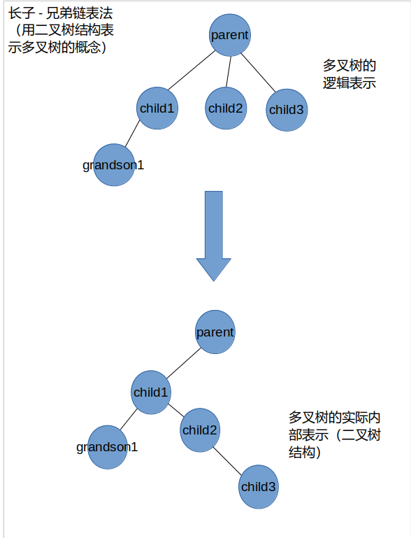
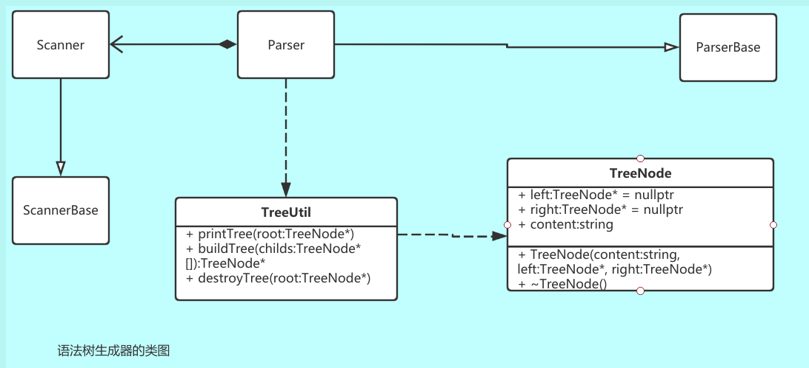
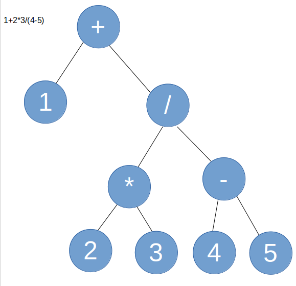

## MINIC词法扫描的设计
根据需求文档定义一个枚举类型变量，取值如下：
 ELSE, IF, RETURN, INT, VOID, WHILE, ID, NUM, LT, LE, GT, GE, EQ, NE, LEFTP, RIGHTP, LEFTS, RIGHTS, LEFTB, RIGHTB, COMMA, SEMICOLON, ADD, SUB, MUL, DIV, ASSIGN
 其中ELSE, IF, RETURN, INT, VOID, WHILE分别表示关键字`else`,`if`,`return`,`int`,`void`,`while`, ID表示由字母构成的标识符，NUM表示整数字面常量，LT，LE, GT, GE, EQ, NE分别表示`<`，`<=`, `>`, `>=`, `==`, `!=`, LEFTP,RIGHTP,LEFTS,RIGHTS, LEFTB, RIGHTB分别表示`(`,`)`,`[`,`]`,`{`,`}`,COMMA表示`,`，SEMICOLON表示`;`，ADD,SUB,MUL,DIV分别表示`+`，`-`，`*`，`/`，ASSIGN表示`=`,是赋值符号。
 为了便于与bisonc++协作进行后面的语法树生成，枚举变量在parse.y中定义，定义格式为：`%token IF, ELSE,...`,使用biconc++编译后会生成一个ParserBase类，该类内部定义了一个枚举变量Token_,包含以上取值

## MINIC的语法树生成器设计

### 使用的数据结构

语法树使用多叉树结构，使用长子-兄弟链表法表示多叉树结构，即内部使用二叉树表示.一个树节点定义如下：
``` c++
struct Node {
    // ...
    string content;
    Node* left;
    Node* right;
}
```
一个Node节点的left指针指向它的第一个孩子节点，right指针指向它的兄弟节点,如图所示




### 语法树生成器的类图




### 语法树的语义结构

#### 程序产生的语法树

形如：`程序（变量声明列表， 函数声明列表）`。

备注：A(B，C，…)是广义表表示法A表示根节点，B，C，…表示根节点A的孩子

#### 函数声明产生的语法树

形如`func_decl（返回类型，函数标识符， 参数列表，函数体）`。函数体是复合语句产生的语法树

#### 复合语句产生的语法树

形如：`{}(局部变量声明列表， 语句列表)`，根节点`{}`表示根树是复合语句， 局部变量声明列表， 语句列表对应两棵语法树

#### 局部变量声明列表产生的语法树

形如：`var_decl（变量声明1， 变量声明2，...)`,``_var_decl`表示根树是局部变量声明产生的语法树， 孩子节点可以是多个变量声明

#### 变量定义产生的语法树

形如：	`var_def(ID, type)`,var_def表示根树是变量定义，ID是变量的标识符，type是变量类型（MINIC中只有int或int[]）

#### 参数列表产生的语法树

形如`param（变量1， 变量2）`

#### 语句列表产生的语法树

形如`语句列表（语句1， 语句2， ...)`,根节点内容是“语句列表”，表明此子树是语句列表，孩子节点是一系列的语句，语句可以是赋值语句，函数调用语句，if语句，while语句，对应不同的语法树

#### 赋值语句产生的语法树

形如:`=(左值, 计算表达式)`,`=`是根节点,左孩子是被赋值的变量，右孩子是计算表达式

#### 变量对应的语法树

形如`var（类型，标识符）`

#### 下标运算产生的语法树

形如：`"[]"(标识符，下标)` 。根节点为`[]`,左孩子是数组变量的标识符, 右孩子是数组的下标取值

#### 关系表达式产生的语法树

关系运算符(左表达式, 右表达式)

#### 计算表达式产生的语法树：

运算符作为根节点，左操作数根节点作为左孩子，右操作数根节点作为右孩子，运算优先级高的计算表达式优先生成语法树。例如`1+2*3/(4-5)`产生的语法树如下：




#### 函数调用语句产生的语法树

 call(函数标识符， 函数参数) 

#### if语句产生的语法树

if(分支条件, 条件成立时执行的复合语句, 不成立时执行的复合语句) 。不成立时执行的复合语句对应else部分的复合语句

#### while语句产生的语法树

 while(循环条件, 复合语句)


### 编译环境

OS：ubuntu18.04 LTS
处理器架构：x86_64
需要工具及版本：
g++ >= 7.5
make >= 4.1
flexc++ >= 2.06.02
bisonc++ >= 6.01.00
如果缺少以上工具，可以使用Linux软件包管理器安装
ubuntu的安装命令：`sudo apt install g++ make flexc++ bisonc++`

### 编译lex文件
词法扫描器使用flexc++ 工具生成，根据flexc++定义的语法编写识别MINIC定义的符号的规则，编写的文件称为lex源文件，假设命名为lexer.l，切换到执行以下命令生成c++代码
``` bash
flexc++ lexer.l
```
会生成Scanner.h, Scanner.ih, Scannerbase.h, lex.cc四个文件，其中Scanner.ih和Scanner.h只会生成一次，其他文件重新编译后会重新生成，因此如果把Scanner.ih的内容删除，可能会引起后来编译失败
### make命令
本项目已写好makefile，切换到项目的app目录，运行`make`即可在bin目录生成可执行文件
