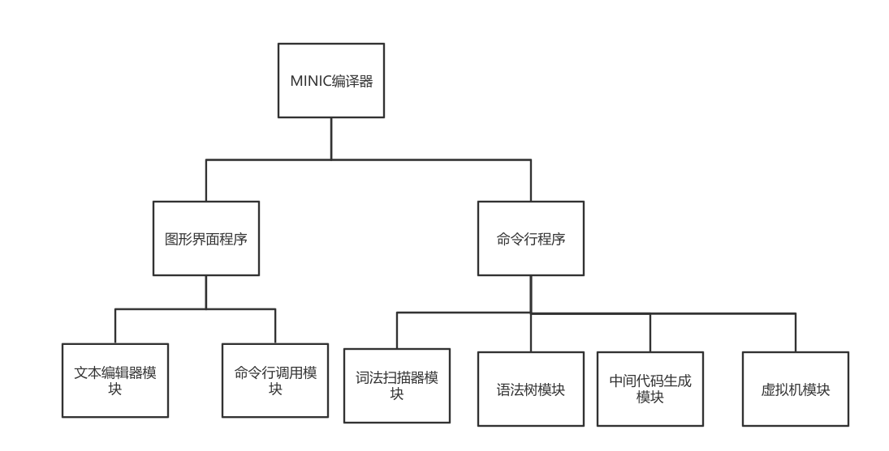
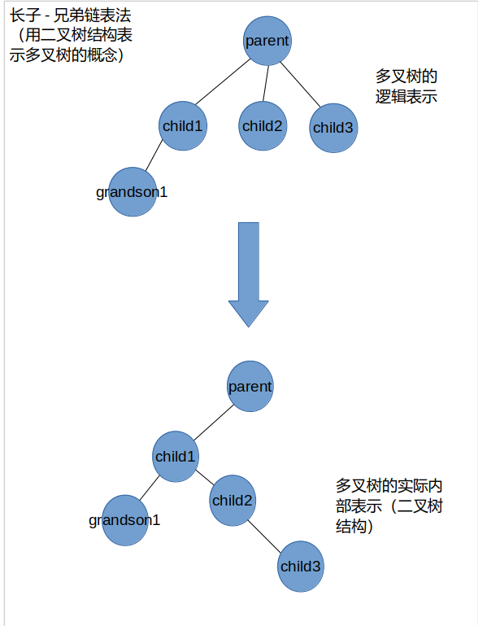
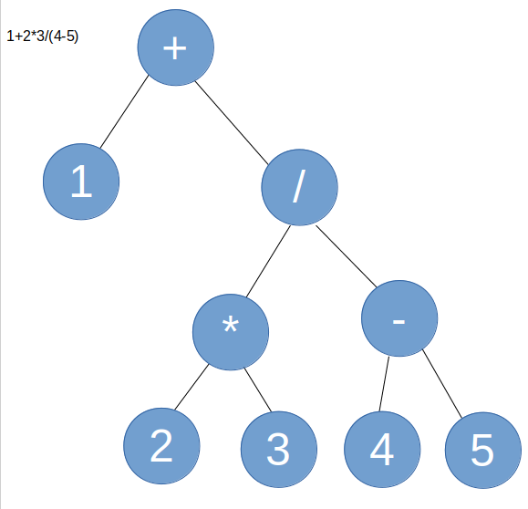
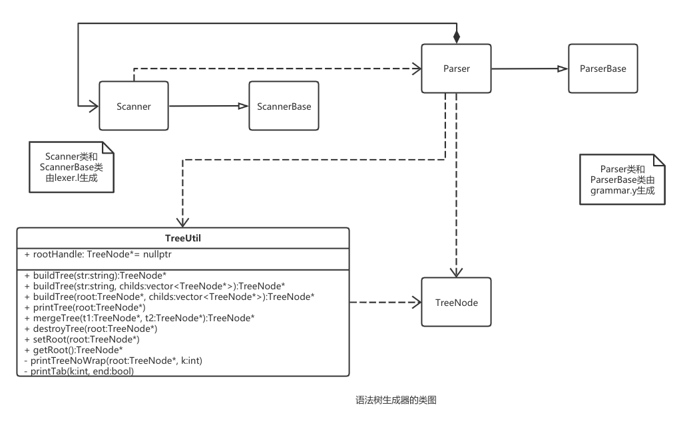
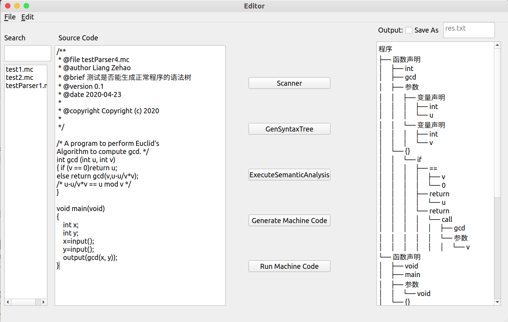

# 详细设计（部分）

## MINIC程序体系结构图



## 词法扫描器的设计

### 定义词法符号

​		根据项目要求确定要获得的词法符号。使用一个枚举变量定义词法符号，取值如下：
 ELSE, IF, RETURN, INT, VOID, WHILE, ID, NUM, LT, LE, GT, GE, EQ, NE, LEFTP, RIGHTP, LEFTS, RIGHTS, LEFTB, RIGHTB, COMMA, SEMICOLON, ADD, SUB, MUL, DIV, ASSIGN。为了与bisonc++配合，枚举变量定义在grammar.y中，定义如下：

```
%token ELSE IF RETURN INT VOID WHILE ID NUM LEFTP RIGHTP LEFTS RIGHTS LEFTB RIGHTB COMMA SEMICOLON ADD SUB MUL DIV
%right ASSIGN
%nonassoc LT LE GT GE EQ NE
```

%right表示在语法分析时该终结符是右结合的

%nonassoc表示语法分析时该终结符是不可结合的

用bisonc++编译grammar.y会生成Parser类和ParserBase的C++代码，在生成的ParserBase类的内部会包含枚举变量的定义

Parser类继承自ParserBase类，如果要使用词法符号的枚举值时只需在枚举值前面加上`Parser::`。例如`return`关键字的枚举值为`Parser::RETURN`，由于使用了Parser类，因此需要在Scanner.ih中包含Parser.ih文件

### 词法符号的取值含义

- ELSE, IF, RETURN, INT, VOID, WHILE分别表示关键字`else`,`if`,`return`,`int`,`void`,`while`, ID表示由字母构成的标识符
- NUM表示整数字面常量
- LT，LE, GT, GE, EQ, NE分别表示`<`，`<=`, `>`, `>=`, `==`, `!=`
- LEFTP，RIGHTP，LEFTS，RIGHTS， LEFTB,，RIGHTB分别表示`(`,`)`,`[`,`]`,`{`,`}`
- COMMA表示`,`
- SEMICOLON表示`;`
- ADD,SUB,MUL,DIV，ASSIGN分别表示`+`，`-`，`*`，`/`，`=`

### 定义匹配模式

在lexer.l文件中编写匹配词法符号的模式（即正则表达式），以及匹配成功后执行的动作，使用flexc++编译lexer.l生成c++代码。

flexc++能处理的词法文件分为两个部分，中间以%%分隔，本项目需要定义的所有匹配规则定义在%%后面，格式如下：

<模式> <空格> <动作>

<模式>由正则表达式或字符串定义，<动作>是匹配成功后执行的c++代码

例如匹配数字的规则如下：

```
[0-9]+ {
    return Parser::NUM;
}
```

匹配标识符的规则如下：

```
[A-Za-z]+ {
	return Parser::ID;
}
```

如果模式字符串被包含在成对双引号之间，则表示按字符串匹配，不使用正则表达式，例如匹配else关键字的规则如下：

```
"else" {
   return Parser::ELSE;
}
```

词法扫描器会从上到下依次尝试匹配每条规则，进行贪婪匹配，如果一个串同时满足两个模式，且匹配字符数多的模式会被优先匹配。动作需要完成以下功能：

- 消除空白字符。空白字符对应的正则表达式是`[ \n\r\t]+`，如果匹配成功后什么也不做，直接开始匹配下一个符号。

- 消除注释。minic定义的注释是被包含在成对的 `/*`、`*/`里面的内容（包括`/*`、`*/`本身）。定义模式`"/*"`,当匹配到这个模式时，说明到达注释开始部分，执行注释消除算法。注释消除算法的伪代码如下：
  1. 获取下一个字符，记为ch。
  2. 如果`ch ==EOF(文件结束符)`，说明注释缺少结束部分，提示出现异常，结束程序；如果`ch == '*'`，获取下一个字符，转3；否则转1
  3. 如果`ch == '*'`，转2,；如果`ch == '/'`，说明注释部分的字符已消耗完毕，算法结束；如果`ch ==EOF(文件结束符)`，说明注释缺少结束部分，提示出现异常，结束程序；否则转1

- 匹配词法符号。当匹配到目标词法符号，直接返回对应的枚举值。为了后面做语法分析时与bisonc++配合，词法符号的枚举变量在grammar.y语法文件中定义

- 处理异常。没有被前面任何一个模式匹配的字符属于未定义字符，应识别出来并抛出异常。`.`表示匹配任何一个除换行符之外的字符，例如：

 ```
. {
      throw std::invalid_argument("遇到未定义符号！");
}
 ```

  

### 词法分析函数的调用

使用flexc++进行编译后会产生Scanner类。`int Scanner::lex()`函数从标准输入流获取输入，根据词法文件的定义返回词法符号的枚举变量的整数值。为了得到打印符号，在主函数中循环调用lex函数，每次用一个switch语句根据lex函数的返回值打印相关信息

## 语法树生成器的设计

### 使用的数据结构

语法树是一个多叉树结构，本项目使用长子-兄弟链表法表示多叉树结构，即内部使用二叉树表示多叉树.一个树节点定义如下：
``` c++
struct Node {
    // ...
    string content;
    Node* left;
    Node* right;
}
```
长子-兄弟链表法：一个Node节点的left指针指向它的第一个孩子节点，right指针指向它的兄弟节点,如图所示




### 语法树结构的定义

以下对语法树的定义使用广义表进行描述。如：A(B，C，…)表示A是根节点，B，C，…是根节点A的孩子子树

#### 程序产生的语法树

`程序（声明1， 声明2， 声明3，...）`。

声明可以是变量声明或者是函数声明

#### 函数声明产生的语法树

`函数声明（返回类型，函数标识符， 参数列表，函数体）`。

函数体是复合语句产生的语法树

#### 复合语句产生的语法树

`{}(变量声明1，变量声明2，...，语句列表)`

#### 变量定义产生的语法树

`变量声明(type, ID)`

ID是变量的标识符，type是变量类型（MINIC中只有`int`或`int[]`),如果是数组类型，则type的值为`int[]`,如果包含数组规模n，则type的值为`int[n]`

#### 参数列表产生的语法树

`参数（变量1， 变量2，...）`

#### 语句列表产生的语法树

`语句列表（语句1， 语句2， ...)`

语句可以是赋值语句，函数调用语句，if语句，while语句

#### 赋值语句产生的语法树

`=(左值, 计算表达式)`

#### 下标运算产生的语法树

`[](标识符，下标)`

#### 关系表达式产生的语法树

`关系运算符(左表达式, 右表达式)`

关系运算符可以是`>,>=, <, <=, ==, !=`

#### 计算表达式产生的语法树：

`运算符(左操作数，右操作数)`

运算优先级高的计算表达式优先产生语法树。例如`1+2*3/(4-5)`产生的语法树如下：




#### 函数调用语句产生的语法树

 `call(函数标识符， 函数参数) `

#### if语句产生的语法树

`if(分支条件, true时执行的语句, false时执行的语句) `

false时执行的语句是可选的，只在存在else分支时才有该子树，语句可以是一条简单语句，也可以是复合语句

#### while语句产生的语法树

` while(循环条件, 条件成立执行的语句语句)`

### grammar.y定义

由前置部分，%%，语法规则定义部分组成。前置部分包含终结符号的定义和头文件包含和某些设置。语法规则定义部分定义非终结符的产生式，第一条产生式视为开始产生式。产生规则定义格式如下：

<非终结符>: <产生式右部> <语义动作>;

如果需要获得终结符号的语义值，使用`d_scanner.matched()`。表示当前匹配终结符的字符串。在$id \to ID$产生式中根据ID的值构造树节点的代码如下

```
id:
    ID {
        $$ = TreeUtil::buildTree(d_scanner.matched());
    }
;
```


### 语法树生成器的类图



### 语法树的打印示例

输入文件内容如下:

```
/* A program to perform Euclid's
Algorithm to compute gcd. */
int gcd (int u, int v)
{ if (v == 0)return u;
else return gcd(v,u-u/v*v);
/* u-u/v*v == u mod v */
}

void main(void)
{ 
    int x;
    int y;
    x=input();
    y=input();
    output(gcd(x, y));
}
```

语法树打印结果如下:

```
程序
├── 函数声明
│     ├── int
│     ├── gcd
│     ├── 参数
│     │     ├── 变量声明
│     │     │     ├── int
│     │     │     └── u
│     │     └── 变量声明
│     │     │     ├── int
│     │     │     └── v
│     └── {}
│     │     └── if
│     │     │     ├── ==
│     │     │     │     ├── v
│     │     │     │     └── 0
│     │     │     ├── return
│     │     │     │     └── u
│     │     │     └── return
│     │     │     │     └── call
│     │     │     │     │     ├── gcd
│     │     │     │     │     └── 参数
│     │     │     │     │     │     ├── v
│     │     │     │     │     │     └── -
│     │     │     │     │     │     │     ├── u
│     │     │     │     │     │     │     └── *
│     │     │     │     │     │     │     │     ├── /
│     │     │     │     │     │     │     │     │     ├── u
│     │     │     │     │     │     │     │     │     └── v
│     │     │     │     │     │     │     │     └── v
└── 函数声明
│     ├── void
│     ├── main
│     ├── 参数
│     │     └── void
│     └── {}
│     │     ├── 变量声明
│     │     │     ├── int
│     │     │     └── x
│     │     ├── =
│     │     │     ├── x
│     │     │     └── call
│     │     │     │     └── input
│     │     ├── =
│     │     │     ├── y
│     │     │     └── call
│     │     │     │     └── input
│     │     └── call
│     │     │     ├── output
│     │     │     └── 参数
│     │     │     │     └── call
│     │     │     │     │     ├── gcd
│     │     │     │     │     └── 参数
│     │     │     │     │     │     ├── x
│     │     │     │     │     │     └── y
```


## 图形界面程序设计

图形界面原型图



词法扫描执行流程
1. 编辑文本
2. 点击词法扫描按钮
3. 编辑中的文本如果没有保存过，打开文件保存对话框；否则自动保存
4. 调用命令行程序，传入文件名作为命令行程序的参数，输出结果保存为一个字符串变量，将输出框文本设置为该变量


