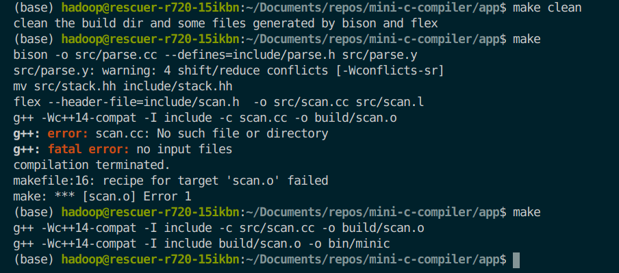

0001:扫描器无法识别未定义的字符
发现时间:2020-03-30
发现人:梁泽浩
状态:未解决

0002:makefile的make结果与预期不符

makefile内容：

```makefile
vpath %.h include
vpath %.hh include
vpath %.l src
vpath %.y src
vpath %.cc src
vpath %.o build


CPPFLAGS = -Wc++14-compat -I include
# OBJS := $(wildcard build/*.o)
OBJS = scan.o
.PHONEY: all install clean test
all: $(OBJS)
	g++ $(CPPFLAGS) build/$(OBJS) -o bin/minic
$(OBJS):%.o :%.cc
	g++ $(CPPFLAGS) -c $< -o build/$@
scan.cc scan.h:scan.l parse.h
	flex --header-file=include/scan.h  -o src/scan.cc src/scan.l
stack.hh parse.h parse.cc:parse.y
	bison -o src/parse.cc --defines=include/parse.h src/parse.y
	mv src/stack.hh include/stack.hh
install:
#todo
	@echo install
clean:
	@echo clean the build dir and some files generated by bison and flex
	@rm -f build/*.o src/scan.cc src/parse.cc include/scan.h include/parse.h include/stack.hh
test:
#todo
	@echo $@

```

截图：

第一次make不能识别出scan.cc在src目录下，第二次make识别出scan.cc在src目录下

分析：

scan.o的构建依赖scan.cc, 一开始在当前目录和src目录都找不到scan.cc，但是找到了scan.cc的构建规则，但`scan.cc scan.h:scan.l parse.h`，告诉make可以在当前目录生成scan.cc，所以根据这条规则构建后就会在当前目录找`scan.cc`，找不到就直接报错，而不会根据`vpath %.cc src`到src找；第二次make时由于已经在src目录生成了`scan.cc`，所以scan.o可以正常构建。

解决方案：

将第17行的代码的`scan.cc scan.h:scan.l parse.h`改成`src/scan.cc scan.h:scan.l parse.h`,也就是告诉make如果没有`scan.cc`，我可以在`src`目录生成一个`scan.cc`