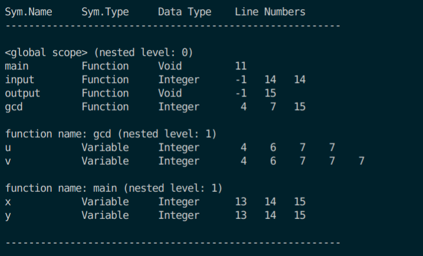

# 详细文档

## 编译工具

`g++和make`：windows可使用[mingw64](https://sourceforge.net/projects/mingw-w64/files/Toolchains%20targetting%20Win64/Personal%20Builds/mingw-builds/8.1.0/threads-posix/seh/x86_64-8.1.0-release-posix-seh-rt_v6-rev0.7z/download)，解压后配置环境变量并修改make的名称为`make.exe`即可;linux平台一般自带了`g++`和`make`

`flexc++和bisonc++`：只在Linux平台上有，可以通过软件仓库安装`sudo apt install flexc++ bisonc++`(apt是Ubuntu的包安装管理器，其他发行版请自行百度)

## 重要术语

- 共用体（Union）：C或C++的一种数据类型， 共用体可以定义多个数据类型， 它们共用同一个内存区域， 共用体变量的大小以最大的数据类型为准， 在同一时刻共用体只能被解释成其中一种类型

- 可变参数：需要`include <stdarg.h>`,可以把函数的最后一个参数的数据类型定义为`...`以允许函数有不定长个参数，在函数内通过`va_list ap;`获取可变参数，例子如下：

 ```c
  #include<stdarg.h> 
  void yyerror(const char* message, ...)
  {
  	fprintf(listing, "Error at Line %d Column %d: ", yylloc.first_line, yylloc.first_column);
  	va_list ap; // 指向参数的指针
      va_start(ap, message); // 宏初始化
  	vfprintf(listing, message, ap);
  	va_end(ap);
      fprintf(listing, ".\n");
  	Error = TRUE;
  }
 ```

  

## 词法符号

关键字： IF ELSE INT VOID WHILE RETURN

标识符：ID

数字字面量：NUM

运算符`=、==、！=、<=、>=、<、>、+、-、×、/`：ASSIGN EQ NEQ LTEQ GTEQ LT GT PLUS MINUS TIMES OVER

括号符号`(、)、[、]、{、}`： LP RP LB RB LC RC

冒号和逗号：SEMI COMMA

此处定义的符号就是语法分析用到的终结符

使用flex工具生成， 需要输入一个声明了词法符号（使用正则表达式定义）的lex文件（`.l`后缀的文本文件）

词法符号每行以`符号名 : 实际值`的格式打印，例子如下：

```
NUM : 24
ID : ans
LE : <
...
```


## 语法分析

使用bison生成语法分析器，此工具使用的是LALR(1)分析法， 需要输入一个定义BNF和语义动作的yacc文件（`.y`后缀的文本文件）。yacc文件的重要关键字介绍如下

### %union

```
%union { 
	struct treeNode * node;
    int op; 
	int val; 
	char name[256];
};
```

有时候需要指定终结符和非终结符的数据类型，这些数据类型就定义在 `%union`块中

### %type

```
%type<node> term
```

用于声明词法符号，如果加上`<node>`， 则指定词法符号的数据类型为node，这里的node是在`%union`中定义的

### yyerror

```c
#include<stdarg.h> 
void yyerror(const char* message, ...)
{
	fprintf(listing, "Error at Line %d Column %d: ", yylloc.first_line, yylloc.first_column);
	va_list ap; // 指向参数的指针
    va_start(ap, message); // 宏初始化
	vfprintf(listing, message, ap);
	va_end(ap);
    fprintf(listing, ".\n");
	Error = TRUE;
}
```

实现yyerror函数，当语法分析出错时执行该函数，一般是打印错误发生的行号位置

## 语法树定义

### 树节点（TreeNode）包含属性

- 众孩子结点指针
- 兄弟结点指针
- 行号
- 结点类型
- 结点属性
- 表达式类型（用于语义分析中的类型检查， 可空）
- 描述信息（打印语法树时显示的内容， 可选)

### 结点类型

- 语句结点（StmtK)
- 表达式结点（ExpK） 
- 声明结点（DeclK) 
- 参数结点(ParamK) 
- 类型结点(TypeKind)

每个树节点只能属于一种结点类型， 故将结点类型定义在一个共用体变量中 

**语句结点取值**：if-结点（IfK）， while-结点（IterK）， return-结点（RetK）， 复合结点（CompK）

**表达式结点取值**：赋值结点（AssignK）， 调用结点（CallK），操作符结点（OpK）， 常量结点（ConstK)，非数组变量（下面简称变量）结点(IdK)， 数组结点(ArrIdK)

**参数结点取值**：数组参数(ArrParamK)， 非数组参数(NonArrParamK)

**类型结点取值**：类型名(TypeNameK)

各个结点类型的所有取值定义成一个枚举变量， 如`enum {IfK, IterK, RetK, CompK} StmtK；`表示`StmK`变量保存了语句节点的具体取值

### 结点属性

- 操作符名
- 数据类型
- 值
- ID名
- 数组属性arr
- 作用域

以上结点属性不能同时存在于一个树节点中，树节点的结点类型决定了使用哪一个结点属性， 故结点属性使用共用体变量保存

### 数组属性

- ID名
- 数据类型
- 规模大小

### 表达式类型

根据需要给结点赋予表达式类型，用于语义分析阶段的类型检查


## 语义分析

主要包含类型检查和生成符号表两个部分，此外语法树生成也视为语义分析的一个部分

### 关键语义动作

var-declaration→ type-specifier ID ; 

1. 左部创建VarK的声明结点
2. 设置结点的行号和ID名
3. 修改孩子指针

var-declaration→ type-specifier ID[NUM]; 

1. 左部创建ArrVarK的声明结点
2. 给结点设置行号、数组属性的ID名和规模大小
3. 修改孩子指针

 type-specifier→ int | void

1. 左部创建TypeNameK的类型结点
2. 设置结点的数据类型

fun-declaration→ type-specifier ID( params ) compound-stmt

1. 左部创建FuncK的声明结点
2. 设置结点行号和ID名
3. 修改孩子指针

params→ void

1. 左部创建TypeNameK的类型结点
2. 设置结点数据类型

param→ type-specifier ID 

1. 左部创建NonArrParamK的参数结点
2. 设置ID名
3. 修改孩子指针

param→ type-specifier ID[ ]

1. 左部创建ArrParamK的参数结点
2. 设置ID名
3. 修改孩子指针

compound-stmt→ { local-declarations statement-list }

1. 左部创建CompK的语句结点
2. 修改孩子指针

selection-stmt→ if(expression) statement  

​                                | if(expression)statement else statement

1. 左部创建IfK的语句结点
2. 修改孩子指针

iteration-stmt→ while (expression) statement

1. 左部创建IterK的语句结点
2. 修改孩子指针

return-stmt→ return ; | return expression;

1. 左部创建Ret的语句结点
2. 修改孩子指针

expression→ var = expression | simple-expression

1. 左部创建AssignK的表达式结点
2. 修改孩子指针

 var→ ID

1. 左部创建IdK的表达式结点
2. 设置ID名

var→ ID[expression]

1. 左部创建ArrIdK的表达式结点
2. 设置数组属性的Id名
3. 修改孩子指针

simple-expression→ additive-expression relop additive-expression 

additive-expression→ additive-expression addop term

term→ term mulop factor

1. 左部创建OpK的表达式结点
2. 设置结点的操作符名
3. 修改孩子指针

factor→ NUM

1. 左部创建ConstK的表达式结点
2. 设置值

call→ ID(args)

1. 左部创建CallK的表达式结点
2. 设置ID名

### 打印语法树

调用parse函数分析语法并执行上面的语义动作后，语法树的结构已经生成，函数会返回语法树的根节点，通过根节点的深搜可以遍历整个语法树

### 类型检查

minc的input和output函数是minic预定义的，即假设他们已经被定义好了，类型检查需要为input函数和output函数建立语法树节点，并把符号插入到符号表中


### 生成符号表

在一个作用域内声明的变量都要加到该作用域的符号表中

#### 符号表打印格式

| 符号名 | 符号类型 | 数据类型 | 行号 |
| ------ | -------- | -------- | ---- |
|        |          |          |      |

符号可能会在多处地方出现，每处的行号都要加入符号表中

符号的内存位置是模拟的，只需要保证同一个作用域的符号位置不同就行了，为了方便分配位置，使用一个location表存储每个作用域已分配的变量的位置数量

程序会可能有多个作用域，本项目由于变量声明只能出现在全局或函数体的开头，因此作用域只分全局作用域和某函数作用域两类。每个作用域都有一个符号表，符号表前应有一个标题，指出此符号表的作用域范围和嵌套层次，标题格式为`<作用域名称> (嵌套层次)`



#### 数据结构选择

符号用一个结构体表示，属性包含标识符名字、存放变量的内存位置、语法树节点(可以得到数据类型)和行号列表

同一个符号的所有行号使用链表存储，每个节点存储行号和下一个节点的指针

一个作用域有多个符号，用一个结构体表示。包含的成员有存储该作用域声明的所有变量的散列表、作用域的嵌套深度、指向父作用域的指针

多个作用域使用倒排链表+数组，即每个作用域都有一个指向父作用域的指针，每个作用域变量存到一个数组里。为了便于计算嵌套的深度和插入符号， 需要一个LIFO的数据结构，也就是栈来临时存放作用域


## 中间代码生成

使用的是《编译原理与实践》书中提到的代码指令

中间代码每行的格式为：`位置: 指令 操作数1 操作数2 操作数3（可选）`