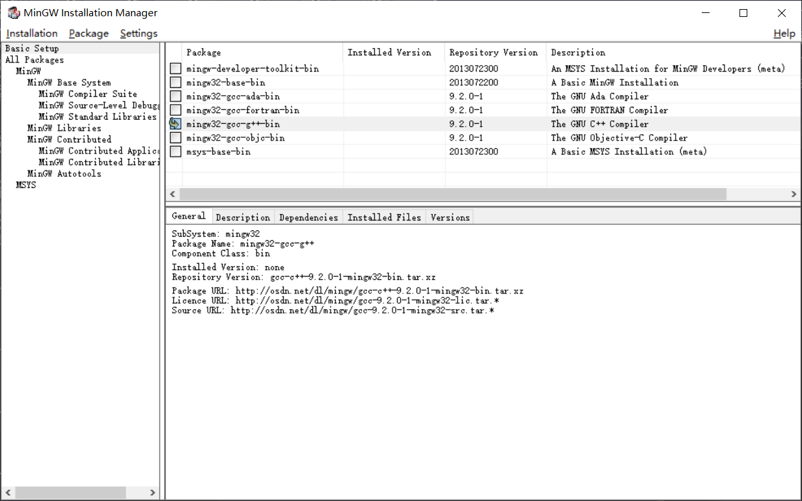

# mini-c-compiler

>   [toc]
>
> 

## 功能说明

程序分成分成命令行和图形界面两个部分。

命令行程序包括MINIC的词法扫描器，MINIC的语法树产生器，MINIC的语义分析器，MINIC的中间代码产生器，MINIC的虚拟机程序。这些程序彼此独立，可以在终端单独运行

目前已生成scan.exe和genTree.exe两个命令行程序.

打开程序所在目录(`app/bin`),终端运行 `scan.exe test.mc`,程序解析 test.mc文本文件中的词法符号,结果打印到屏幕上

终端运行`genTree.exe test.mc`,程序解析`test.mc`文件中的语法,语法树打印到屏幕上

图形界面程序包含文本编辑器的文本编辑，新建文件，打开文件，保存文件功能，同时有一个MINIC实验菜单，菜单项有词法扫描，语法树生成，语义分析，中间代码生成，在虚拟机运行中间代码，点击菜单项调用对应的命令行程序，以文本编辑区的内容作为标准输入，命令行程序的输出显示在界面的输出区域上。目前尚未实现

## 构建说明

### 在Windows平台上的编译环境

OS: windows 10

系统位数:64位

需要的工具:

mingw32(包含mingw32-gcc-g++-bin和mingw32-make)

diff >= 3.6

如果电脑安装了devcpp,则已包含了mingw32,只需要把`mingw32/bin`添加到环境变量path中即可.如果系统没有mingw32. 则运行本项目附带的mingw-get-setup.exe进行安装,安装过程需要安装以下package:

mingw32-gcc-g++-bin

mingw32-make

勾选了相应的package之后点击菜单Installation->Apply Changes开始下载安装

如果电脑已安装了git并将bin目录添加到环境变量中,则系统已包含了diff.exe,如果没有,请将项目tools目录下的diff.exe添加到环境变量中

备注: 由于flexc++和bisonc++没有windows上可运行的二进制文件,所以无法编译lexer.l和grammar.y,目前是先在linux上编译生成c++代码,再拿到windows平台用mingw编译的

## 程序执行的使用说明

1. 确保mingw的bin目录和diff.exe所在目录已经添加到环境变量path中

2. 确保mingw的bin目录存在mingw32-make.exe, 简单起见,请重命名为make.exe

3. win10终端默认字符集编码为gbk(936),本项目的程序输出信息的字符集编码为utf8(65001),为了得到正常的输出,请输入命令:`chcp 65001`

4. 在终端切换到项目的app目录,输入命令`make`,将在app/bin目录生成exe可执行程序

5. 输入命令 `make test`,运行预先编写好的测试用例(包含测试词法扫描器的4个用例和测试语法树的5个测试用例),如果输出有一行"测试通过"的字符串,说明测试全部通过.

6. 切换到bin目录:`cd bin`. 编写minic源文件,保存为`test.mc`

7. 终端运行`.\scan.exe test.mc`程序解析 test.mc文本文件中的词法符号,结果打印到屏幕上

    终端运行`.\genTree.exe test.mc`,程序解析`test.mc`文件中的语法,语法树打印到屏幕上

## 测试数据

测试的输入文件在`app/test/in/`文件夹中.预期输出保存在`app/test/check`目录的文件中

## 可执行程序

可执行程序在`app/bin`目录下